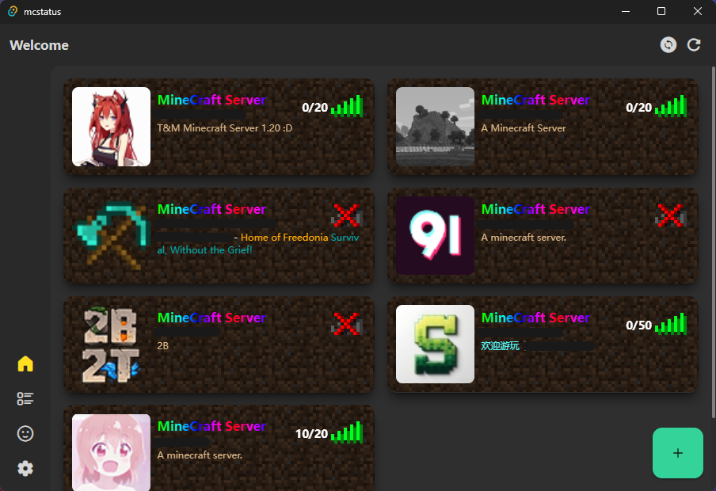
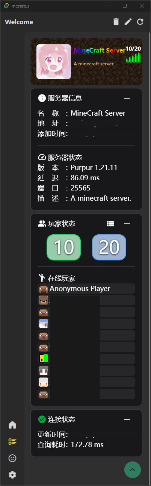

# mc-status-tauri

> [ `NameOfShadow` ](https://github.com/NameOfShadow)/[ `rust-mc-status` ](https://github.com/NameOfShadow/rust-mc-status) 
> 
> 
> 

<!--  -->

> [ `SharkBee80` ](https://github.com/SharkBee80)/[ `tauri-plugin-mc-status` ](https://github.com/SharkBee80/tauri-plugin-mc-status) 
> 

## description

查询minecraft服务器状态  
query minecraft server status

## platform

`android` ﹑ `windows`

~~`macOS`~~ ﹑~~`iOS`~~ - <u>without Mac and Xcode</u>

## screenshot

## License 
